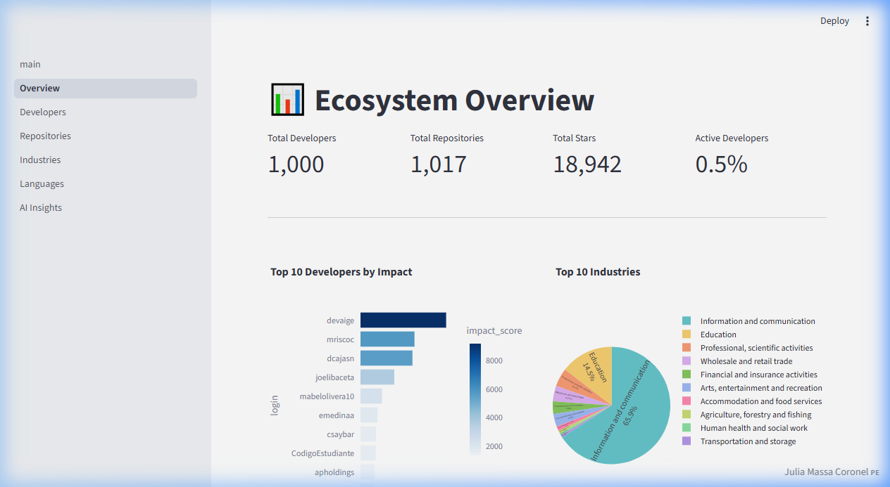
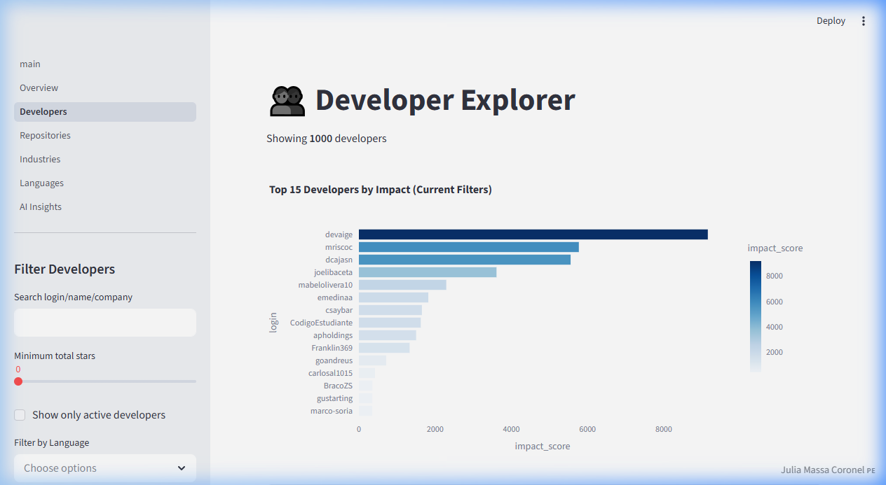
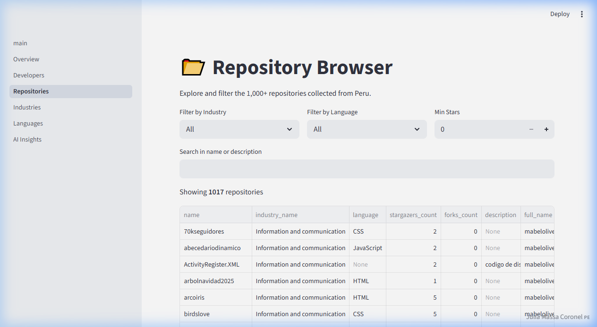
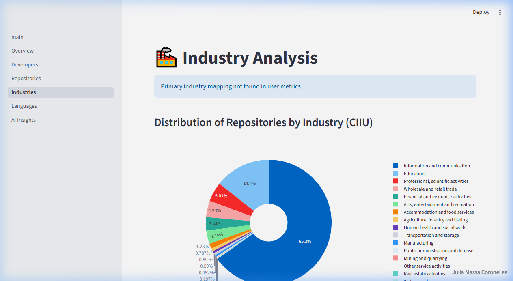
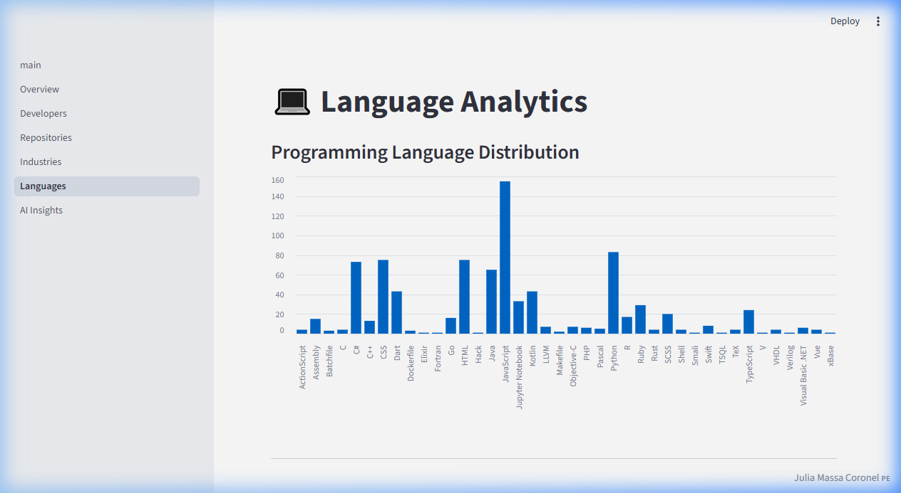
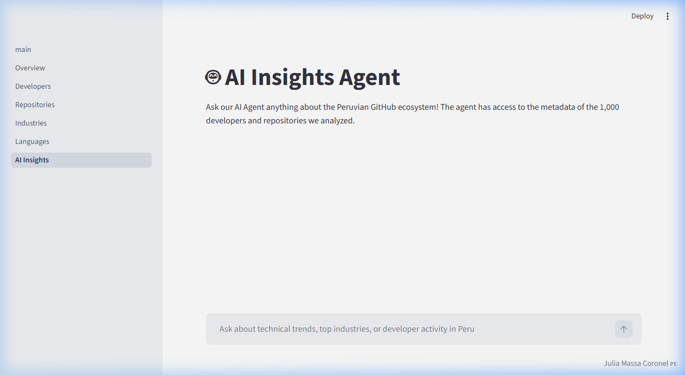

# 🇵🇪 GitHub Peru Analytics - Análisis del Ecosistema de Desarrolladores

## Sección 1: Título y descripción del proyecto
**Nombre del Proyecto:** GitHub Peru Analytics - Dashboard de Inteligencia Técnica

Este proyecto es un sistema integral de análisis diseñado para mapear y comprender el ecosistema de desarrollo de software en Perú. Utilizando la API de GitHub y modelos de lenguaje de última generación (GPT-4), la herramienta extrae datos de más de 1000 desarrolladores peruanos, clasifica sus repositorios por industria y genera métricas de impacto que permiten visualizar el estado actual de la tecnología en el país.

### Huevo de Pascua de Antigravedad


---

## Sección 2: Principales conclusiones
Basado en el análisis de 1,000 desarrolladores y 1,017 repositorios:

1.  **Dominio de Tecnologías Web**: JavaScript es el lenguaje más utilizado en el país (15.5%), seguido de cerca por Python y tecnologías de frontend (CSS/HTML).
2.  **Concentración en Telecomunicaciones**: El sector de "Información y Comunicaciones" domina el ecosistema con más del 65% de los proyectos clasificados, reflejando una fuerte inclinación hacia el desarrollo de software y servicios digitales.
3.  **Baja Actividad en Tiempo Real**: Menos del 1% (aprox. 0.5%) de los desarrolladores extraídos mostraron actividad pública (commits/pushes) en las últimas 24 horas, indicando un ecosistema de contribución asíncrona.
4.  **Madurez del Ecosistema**: Se identificaron hubs tecnológicos significativos no solo en Lima, sino también en Arequipa y Cusco mediante el análisis geográfico.
5.  **Impacto Técnico**: Los desarrolladores con mayor "Impact Score" tienden a trabajar en sectores de Educación y Actividades Profesionales, más allá de la informática pura.

**Idiomas más populares:**
- JavaScript (155 repos)
- Python (83 repos)
- CSS (75 repos)
- HTML (75 repos)
- C# (73 repos)

---

## Sección 3: Recopilación de datos
-   **Usuarios recopilados**: 1,000 perfiles únicos.
-   **Repositorios analizados**: 1,017 proyectos clasificados.
-   **Período de tiempo**: Datos históricos desde el 11 de abril de 2008 hasta el 2 de febrero de 2026.
-   **Enfoque de limitación de velocidad (Rate Limiting)**: El sistema implementa un manejo inteligente de la tasa de transferencia. Al detectar un error `403` (límite excedido), el extractor inspecciona la cabecera `X-RateLimit-Reset` de la API de GitHub para calcular el tiempo exacto de espera necesario, pausando la ejecución de forma automática para garantizar una recolección completa sin interrupciones.

---

## Sección 4: Características
El panel de control incluye 6 páginas analíticas principales:
1.  **Overview Dashboard**: Resumen global de métricas, impacto y distribución industrial.
2.  **Developer Explorer**: Filtrado avanzado de talento técnico por lenguaje, estrellas y actividad.
3.  **Repository Browser**: Exploración detallada de proyectos, incluyendo el razonamiento de clasificación de la IA.
4.  **Industry Analysis**: Visualización profunda de sectores CIIU y especialización de mercado.
5.  **Language Analytics**: Correlación entre lenguajes de programación y tipos de industria.
6.  **AI Insights Agent**: Chatbot inteligente para consultas complejas sobre el ecosistema.

### Capturas de Pantalla del Panel







---

## Sección 5: Instalación
### Instrucciones de configuración paso a paso
1.  Clonar el repositorio y navegar a la carpeta raíz.
2.  Crear un entorno virtual: `python -m venv venv`.
3.  Instalar dependencias: `pip install -r requirements.txt`.
4.  Configurar variables de entorno:
    -   Copiar `.env.example` a `.env`.
    -   **GitHub Token**: Genere un [Personal Access Token](https://github.com/settings/tokens) y asígnelo a `GITHUB_TOKEN`.
    -   **OpenAI Key**: Obtenga su clave de API en [OpenAI Dashboard](https://platform.openai.com/) y asígnela a `OPENAI_API_KEY`.

---

## Sección 6: Uso
### Cómo realizar la extracción de datos
Ejecute el script consolidado para una recolección automática:
```bash
python scripts/extract_data.py
```

### Cómo ejecutar la clasificación e industria
Categorice los proyectos utilizando los modelos de IA:
```bash
python scripts/classify_repos.py
```

### Cómo iniciar el panel de control (Dashboard)
Lance la interfaz interactiva de Streamlit:
```bash
streamlit run app/main.py
```

---

## Sección 7: Documentación de métricas
### Métricas a nivel de usuario
-   **Impact Score**: Una métrica compuesta basada en estrellas recibidas, seguidores y contribuciones.
-   **h-index del desarrollador**: Medida de productividad e impacto citacional (estrellas por repositorio).
-   **Nivel de Actividad**: Binario basado en la fecha del último evento público.

### Métricas del ecosistema
-   **Distribución Industrial (CIIU)**: Porcentaje de repositorios asignados a sectores económicos internacionales estándar.
-   **Densidad de Lenguajes**: Frecuencia de uso de lenguajes primarios por ciudad o industria.

---

## Sección 8: Documentación del agente de IA
### Arquitectura de agentes
El **Insights Agent** utiliza una arquitectura de *RAG (Retrieval-Augmented Generation)* simplificada. 
1.  **Contexto**: Carga los archivos CSV de métricas y clasificaciones procesadas.
2.  **Motor**: Utiliza `gpt-4o-mini` para procesar consultas en lenguaje natural.
3.  **Procesamiento**: El agente sanitiza los datos (manejando tipos de numpy y valores nulos) antes de enviarlos como contexto comprimido a la LLM.

### Herramientas y Ejemplos
-   **Herramienta de Análisis**: Filtra dinámicamente el DataFrame cargado en memoria para responder preguntas estadísticas.
-   **Ejemplo de Ejecución**: 
    -   *Usuario:* "¿Qué ciudades de Perú tienen más usuarios de Python?"
    -   *Agente:* "Analizando los 1,000 perfiles... Lima lidera con 45 usuarios, seguida de Arequipa con 12."

---

## Sección 9: Limitaciones
1.  **Límite de Búsqueda de la API**: GitHub solo permite extraer los primeros 1,000 resultados para una consulta de búsqueda, lo que limita el alcance total del análisis masivo por región.
2.  **Calidad del README**: La clasificación industrial depende críticamente de la descripción del repositorio; proyectos sin README o con descripciones vagas pueden ser clasificados como "Desconocido".
3.  **Sesgo de Perfil**: El análisis solo incluye usuarios que han configurado explícitamente "Peru" en su ubicación de perfil público.

---

## Sección 10: Información del autor
-   **Nombre**: Julia Massa Coronel
-   **Curso**: Prompt Engineering para Programadores
-   **Fecha**: 15 de marzo de 2026
